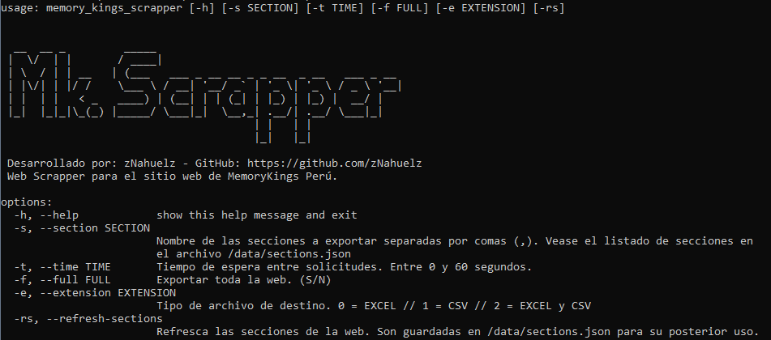
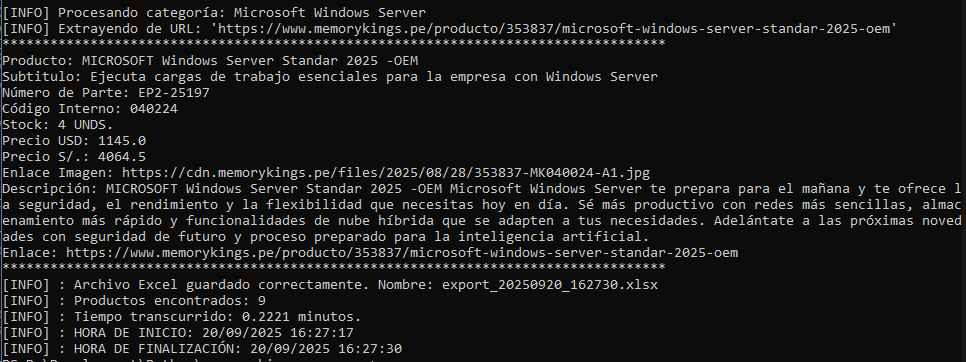
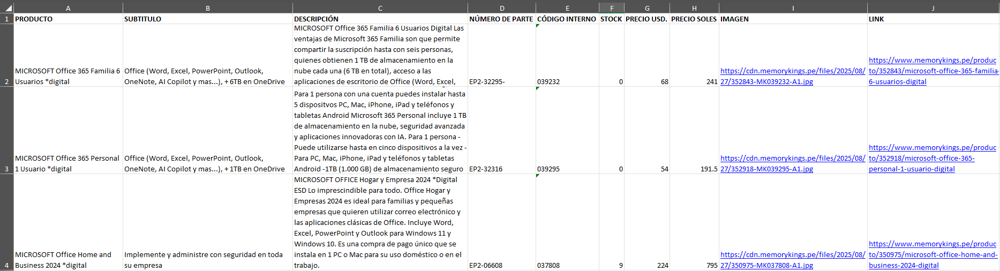

# Descripción
memory-kings-scraper es un [web scraper](https://www.parsehub.com/blog/what-is-web-scraping/) desarrollado utilizando Python con propósitos recreativos y educativos. Además, es una buena herramienta para extraer un listado de productos de distintas categorías en formato Excel para realizar builds de computadoras cómodamente.

## Características
- Extracción de todos los productos por categorías de la web
- Extracción de secciones (con categorías hijas) de la web
- Guardado de resultados en formato Excel y .csv
- Formato de resultados .csv: Producto,Subtitulo,Descripcion,Numero de Parte, Codigo Interno, Stock, Precio Usd, Precio Soles, Imagen, Link
- Formato de resultados Excel: Archivo de excel con una hoja por cada categoría de la sección.

## Tecnologías y dependencias
- [Python 3.13.7](https://www.python.org/) 
- [Argparse](https://docs.python.org/3/library/argparse.html) (Ayudante CLI)
- [BeautifulSoup4](https://www.crummy.com/software/BeautifulSoup/bs4/doc/) (HTML Parser)

## Requisitos
- Python >=3
- Argparse ```pip install argparse```
- BeautifulSoup4 ```pip install beautifulsoup4```

## Argumentos
| Argumento | Descripción |
| ------ | ------ |
| -h --help | Mostrar ayuda. |
| -s --section | Nombre de las secciones para realizar la extracción, separadas por comas (,). Las secciones se pueden refrescar con -rs y visualizarse en el archivo /data/sections.json |
| -t --time | Tiempo de espera entre solicitudes (Entero entre 0 y 60). Por defecto: 0 |
| -f --full | Extraer todos los productos de la web (S/N). Por defecto: N |
| -e --extension | Tipo de archivo de destino. (0 para excel, 1 para .CSV, 2 para ambos). Por defecto: 0  |
| -rs --refresh-sections | Refresca el listado de secciones de la web. Son guardadas en /data/sections.json para su uso. |

## Uso
### Primer uso
Clonar el repositorio:
```git clone https://github.com/zNahuelz/memory-kings-scrapper.git```

```sh
cd memory-kings-scrapper
python .\main.py -rs
python .\main.py -s "NOMBRE_SECCION"
```
Posteriormente se puede utilizar sin -rs antes de la extracción.
```sh
cd memory-kings-scrapper
python .\main.py -s "NOMBRE_SECCION" -t 10 -e 1
```

## Imágenes
Ayuda de la herramienta


Herramienta trabajando


Resultado en Excel

